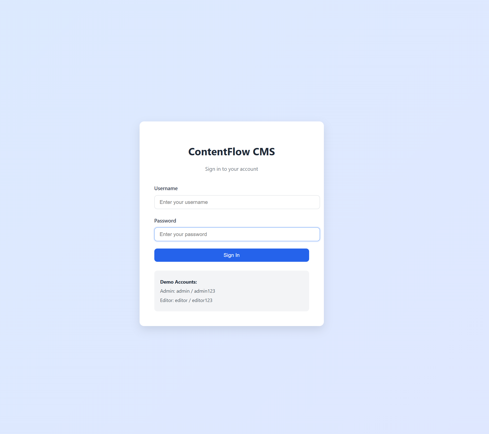
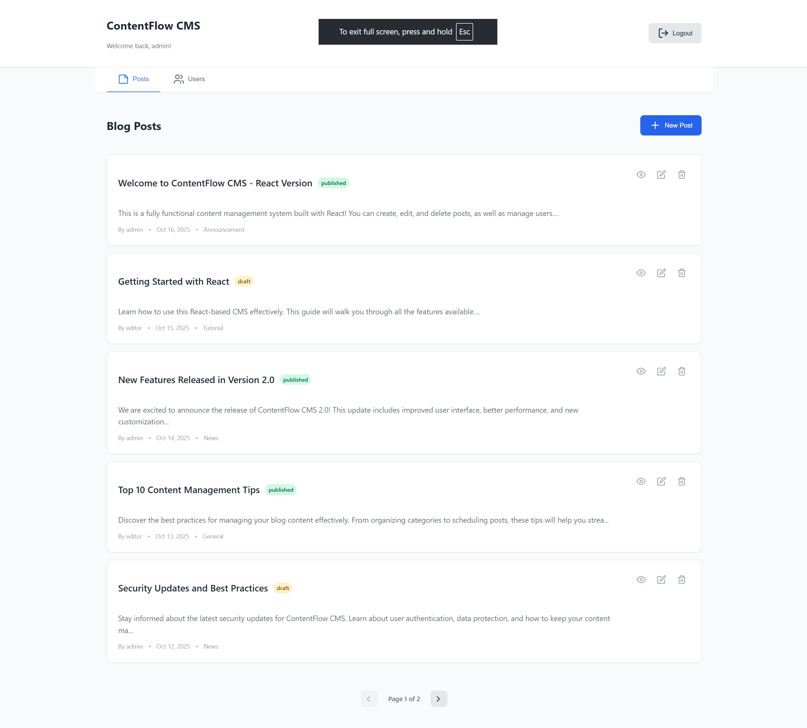
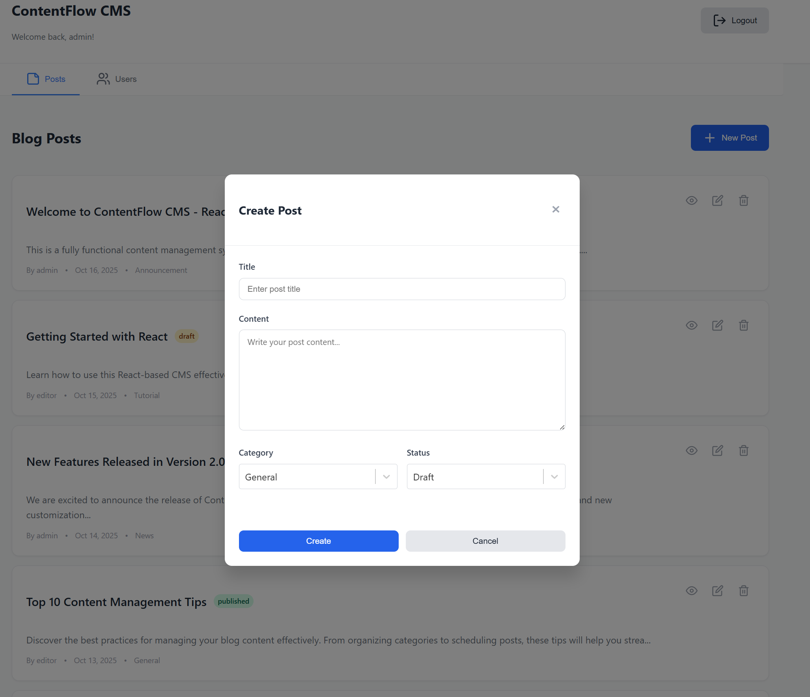
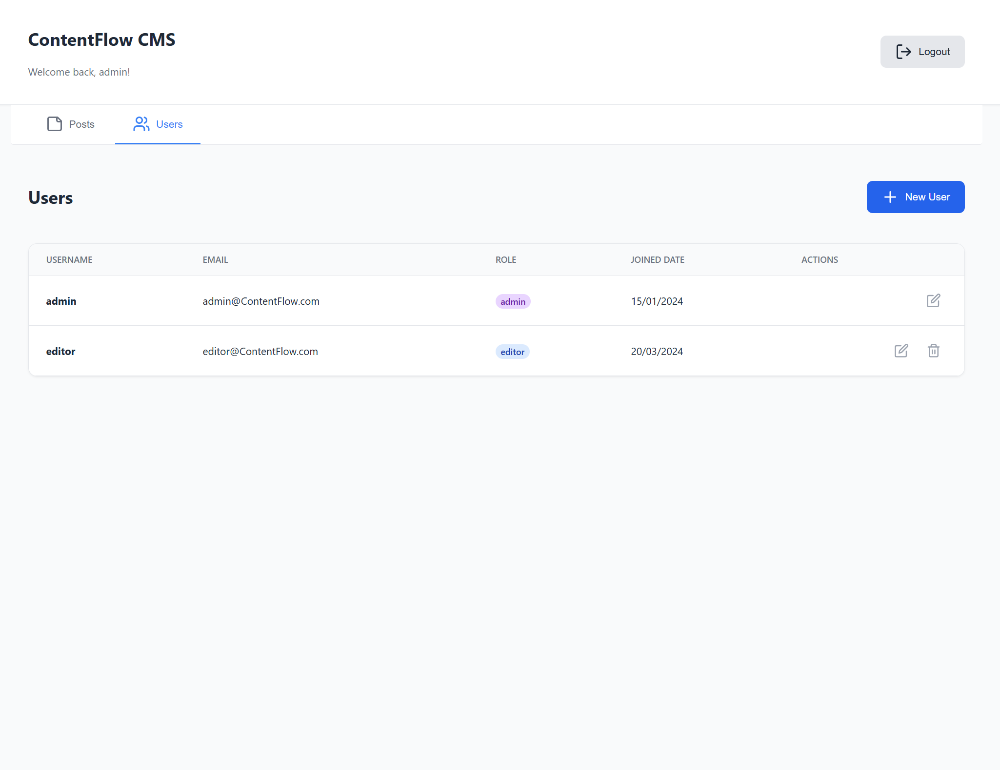
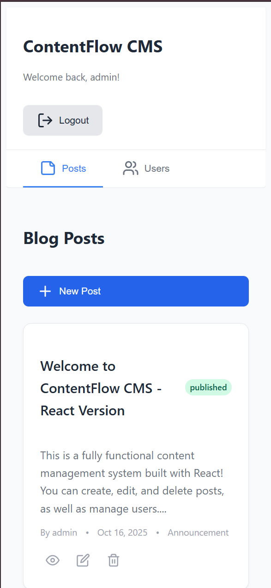

<div align="center">

# 📝 ContentFlow CMS

### A Modern, Accessible Content Management System Built with React

[](https://react.dev)
[](https://vitejs.dev)
[](https://developer.chrome.com/docs/lighthouse)
[](https://vitest.dev)

[🚀 Live Demo](#) • [📖 Documentation](#features) • [🐛 Report Bug](#) • [✨ Request Feature](#)

</div>

---

## 📋 Table of Contents

- [Overview](#-overview)
- [Features](#-features)
- [Tech Stack](#-tech-stack)
- [Accessibility](#-accessibility)
- [Testing](#-testing)
- [Getting Started](#-getting-started)
- [Usage](#-usage)
- [Project Structure](#-project-structure)
- [Screenshots](#-screenshots)
- [What I Learned](#-what-i-learned)
- [Future Enhancements](#-future-enhancements)
- [License](#-license)

---

## 🌟 Overview

**ContentFlow CMS** is a fully functional, production-ready content management system built with React and Vite. It demonstrates modern web development practices including component-based architecture, accessibility standards, and comprehensive testing strategies.

### ✨ Highlights

- 🎯 **100/100 Lighthouse Accessibility Score**
- ✅ **20 Automated Tests** (Unit + E2E)
- ♿ **WCAG 2.1 Level AA Compliant**
- 📱 **Fully Responsive Design**
- 🔐 **Role-Based Access Control**
- ⚡ **Lightning-Fast Performance**

---

## 🚀 Features

### 📝 Content Management
- ✅ Create, Read, Update, Delete (CRUD) blog posts
- ✅ Rich content editing with title, content, category, and status
- ✅ Real-time post preview
- ✅ Draft and Published status management
- ✅ Post categorization (Tutorial, News, General, Announcement)

### 👥 User Management
- ✅ User authentication system
- ✅ Role-based access (Admin & Editor)
- ✅ User CRUD operations (Admin only)
- ✅ Password visibility toggle
- ✅ Form validation with error messages

### 🎨 User Experience
- ✅ Intuitive dashboard interface
- ✅ Modal-based workflows
- ✅ Pagination for large datasets
- ✅ Responsive design (mobile, tablet, desktop)
- ✅ Loading states and error handling

### ♿ Accessibility Features
- ✅ Full keyboard navigation
- ✅ Screen reader support (ARIA labels, roles, live regions)
- ✅ Focus management and focus trap in modals
- ✅ Semantic HTML structure
- ✅ Color contrast compliance (WCAG AA)
- ✅ Skip-to-content link

---

## 🛠️ Tech Stack

### Frontend


### Libraries & Tools
- **React Select** - Accessible dropdown components
- **Lucide React** - Modern icon library
- **SVG as React Components** - Optimized icon handling

### Testing


### Development Tools
- **ESLint** - Code linting
- **Git** - Version control
- **VS Code** - Development environment

---

## ♿ Accessibility

ContentFlow CMS is built with accessibility as a **core principle**, not an afterthought.

### WCAG 2.1 Level AA Compliance

✅ **Perceivable**
- Semantic HTML structure
- ARIA labels and roles
- Color contrast ratio 4.5:1+
- Text alternatives for icons

✅ **Operable**
- Full keyboard navigation
- Focus indicators on all interactive elements
- No keyboard traps (except intentional focus trap in modals)
- Skip-to-content link

✅ **Understandable**
- Clear error messages
- Consistent navigation
- Form labels and validation
- Predictable behavior

✅ **Robust**
- Valid HTML
- Screen reader compatible
- Cross-browser support

### Accessibility Testing
- ✅ Lighthouse: **100/100**
- ✅ axe DevTools: **0 violations**
- ✅ Keyboard navigation: **Fully tested**
- ✅ Screen reader: **NVDA/VoiceOver compatible**

---

## 🧪 Testing

Comprehensive testing strategy ensuring code quality and reliability.

### Test Coverage

| Test Type | Framework | Count | Status |
|-----------|-----------|-------|--------|
| **Unit Tests** | Vitest | 10 | ✅ Passing |
| **E2E Tests** | Cypress | 10 | ✅ Passing |
| **Total** | - | **20** | ✅ **100%** |

### Unit Tests (Vitest + React Testing Library)
```bash
✅ LoginScreen Component (4 tests)
   ✓ Renders login form
   ✓ Shows validation errors for empty fields
   ✓ Handles successful login
   ✓ Shows error for invalid credentials

✅ PostCard Component (6 tests)
   ✓ Renders post information
   ✓ Displays post content
   ✓ Shows author name
   ✓ Handles preview button click
   ✓ Handles edit button click
   ✓ Has delete button
```

### E2E Tests (Cypress)
```bash
✅ Login Flow (5 tests)
   ✓ Displays login form
   ✓ Shows error for empty fields
   ✓ Shows error for invalid credentials
   ✓ Successful admin login
   ✓ Successful editor login

✅ Post Management (5 tests)
   ✓ Displays existing posts
   ✓ Creates new post
   ✓ Opens preview modal
   ✓ Edits existing post
   ✓ Navigates to Users tab
```

### Running Tests
```bash
# Run unit tests
npm test

# Run unit tests with coverage
npm run test:coverage

# Open Cypress (interactive)
npm run cypress:open

# Run E2E tests (headless)
npm run cypress:run
```

---

## 🏁 Getting Started

### Prerequisites

- **Node.js** (v18+ recommended)
- **npm** or **yarn**

### Installation

1. **Clone the repository**
```bash
   git clone https://github.com/yourusername/contentflow-cms-react.git
   cd contentflow-cms-react
```

2. **Install dependencies**
```bash
   npm install
```

3. **Start development server**
```bash
   npm run dev
```

4. **Open in browser**
```
   http://localhost:5173
```

### Demo Accounts

| Role | Username | Password |
|------|----------|----------|
| **Admin** | `admin` | `admin123` |
| **Editor** | `editor` | `editor123` |

---

## 💻 Usage

### Creating a Post

1. Login with demo credentials
2. Click **"New Post"** button
3. Fill in:
   - Title
   - Content
   - Category (Tutorial, News, General, Announcement)
   - Status (Draft or Published)
4. Click **"Create"**

### Editing a Post

1. Click **Edit** icon (pencil) on any post
2. Modify fields
3. Click **"Update"**

### Previewing a Post

1. Click **Preview** icon (eye) on any post
2. View formatted post content
3. Press **Escape** or click **X** to close

### Managing Users (Admin Only)

1. Click **"Users"** tab
2. Click **"New User"** to add
3. Click **Edit** icon to modify
4. Click **Delete** icon to remove

---

## 📁 Project Structure
```
contentflow-cms-react/
├── cypress/                    # E2E tests
│   ├── e2e/
│   │   ├── login.cy.js        # Login flow tests
│   │   └── posts.cy.js        # Post management tests
│   └── support/
├── src/
│   ├── components/            # React components
│   │   ├── __tests__/         # Unit tests
│   │   │   ├── LoginScreen.test.jsx
│   │   │   └── PostCard.test.jsx
│   │   ├── Dashboard.jsx
│   │   ├── Header.jsx
│   │   ├── LoginScreen.jsx
│   │   ├── NavigationTabs.jsx
│   │   ├── PostCard.jsx
│   │   ├── PostModal.jsx
│   │   ├── PostsTab.jsx
│   │   ├── PreviewModal.jsx
│   │   ├── UserModal.jsx
│   │   └── UsersTab.jsx
│   ├── hooks/                 # Custom React hooks
│   │   └── useFocusTrap.js
│   ├── styles/                # CSS styles
│   │   └── App.css
│   ├── svg/                   # SVG icons
│   ├── App.jsx                # Main app component
│   ├── main.jsx               # Entry point
│   └── setupTests.js          # Test configuration
├── index.html
├── package.json
├── vite.config.js
├── cypress.config.js
└── README.md
```

---

## 📸 Screenshots

### Login Screen

*Accessible login form with validation*

### Dashboard - Posts View

*Clean, intuitive post management interface*

### Create/Edit Post Modal

*Modal workflow for creating and editing posts*

### Users Management (Admin)

*Admin-only user management interface*

### Mobile Responsive

*Fully responsive design on all devices*

---

## 🎓 What I Learned

Building ContentFlow CMS was an incredible learning experience:

### Technical Skills
- ✅ **React 19** - Modern React patterns with hooks
- ✅ **State Management** - Complex state handling without external libraries
- ✅ **Component Architecture** - Reusable, maintainable component design
- ✅ **Accessibility** - WCAG 2.1 AA compliance from the ground up
- ✅ **Testing** - Unit testing with Vitest and E2E testing with Cypress
- ✅ **CSS** - Advanced layouts, animations, and responsive design
- ✅ **Vite** - Modern build tooling and HMR

### Best Practices
- ✅ **Semantic HTML** for better accessibility and SEO
- ✅ **ARIA** attributes for screen reader support
- ✅ **Keyboard navigation** as a first-class feature
- ✅ **Focus management** in modals and complex interactions
- ✅ **Form validation** with accessible error messages
- ✅ **Test-driven development** principles
- ✅ **Git workflow** and version control

### Problem Solving
- ✅ Debugging SSL errors during Cypress installation
- ✅ Implementing focus trap without external libraries
- ✅ Creating accessible custom components
- ✅ Writing maintainable E2E tests with reliable selectors
- ✅ Balancing feature richness with simplicity

---

## 🔮 Future Enhancements

Potential features for future iterations:

### Features
- [ ] Search and filter functionality
- [ ] Rich text editor (Markdown support)
- [ ] Image upload and management
- [ ] Post comments system
- [ ] Tags in addition to categories
- [ ] Export posts (PDF, Markdown)
- [ ] Dark mode toggle
- [ ] Multi-language support

### Technical
- [ ] Backend integration (REST API or GraphQL)
- [ ] Database persistence (PostgreSQL, MongoDB)
- [ ] Authentication with JWT
- [ ] CI/CD pipeline (GitHub Actions)
- [ ] Docker containerization
- [ ] Performance monitoring
- [ ] Error tracking (Sentry)
- [ ] Analytics integration

### Testing
- [ ] Visual regression testing (Percy, Chromatic)
- [ ] Performance testing (Lighthouse CI)
- [ ] Increase test coverage to 90%+
- [ ] Accessibility audit automation

---

## 👨‍💻 Author

**Shahab Roknidoost**

- GitHub: [@shahabroknidoost](https://github.com/shahabroknidoost)
- LinkedIn: [Shahab Roknidoost](https://www.linkedin.com/in/shahabroknidoost/)

---

## 📄 License

This project is licensed under the MIT License - see the [LICENSE](LICENSE) file for details.

---

## 🙏 Acknowledgments

- React team for amazing documentation
- Vite for blazing-fast development experience
- Cypress for making E2E testing enjoyable
- The accessibility community for invaluable resources
- Icons by [Lucide](https://lucide.dev)

---

<div align="center">

### ⭐ Star this repo if you found it helpful!


[Back to Top ⬆️](#-contentflow-cms)

</div>